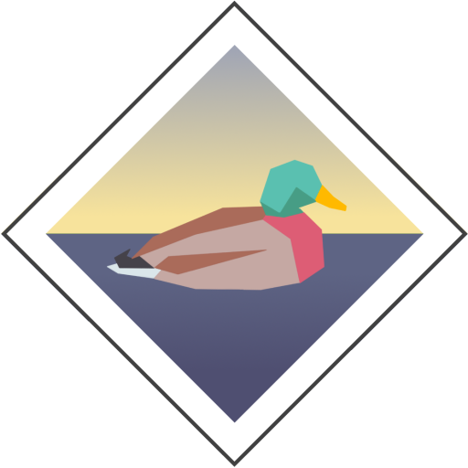
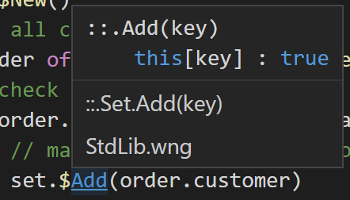

# Wingra
Wingra is a high-level procedural programming language which emphasizes static structural code flow.

Originally created to support game development, the language is general purpose and can have a variety of other applications. The language has been used to create [Defenders On Deck](https://mercurywave.itch.io/defenders-on-deck), and prototype versions of the languages were used to develop [other](https://mercurywave.itch.io/brinebeards-folly) [games](https://mercurywave.itch.io/file-47-an-incident-in-the-exclusion-zone).

## Primary Features
- Dynamic typing
- Block-based significant indentation
- Memory efficiency through ownership passing
- Statically resolvable references
- Flexible data composition
- Run interpreted or transpile to javascript
- Strong tooling

## Example Syntax
```ts
::CustomersWhoBought(product, ?atleast => customers)
    atleast ?: 1 // default to 1 if not passed
    @set : $Set.New()
	using Set
    // find all completed orders
    for @order of ^AllOrders.$List.Where(`it.isComplete`)
        // check quantity
        if (order.items[product] ? 0) >= atleast
            // mark customer as having order
            set.$Add(order.customer)
    // flatten to list
    customers : set.$ToList()
```
### Syntax Features
- Succinct lambda expression syntax with \` \`
- Multiple named output parameters from functions
- Structural safety with async functions and error handling

## Why Use Wingra?

#### Get the benefits of dynamic typing without the common development downsides
Static function resolution means language tooling can provide good auto-completion, signatures, and definitions.



This static code flow also means the compiler can automatically inline functions and constants for improved performance. This can open up many additional possibilities around code flow analysis in future.

The ownership passing model of memory management can avoid the performance penalty of garbage collection and reference counting.


## Quick Start
The quickest way to get started is to download the VSCode extension.
1. Download [VSCode](https://code.visualstudio.com/) for windows
2. Download the Wingra Language extension from the VSCode marketplace
3. Open VSCode to a new folder
4. Add a new file called 'test.wng'
5. Add the following code:
    ```ts
    $IO.Write("Greetings from Lake Wingra!")
    ```
6. Press ctrl+shift+p and select 'Wingra: Run current folder'

## Learning
The [Scripts/Tutorial](Scripts/Tutorials) folder contains a number of guides to basic syntax.

The [Scripts/Samples](Scripts/Samples) folder contains some more realistic samples of how the language can be used.

## Current State and Future
The language is still relatively young, and probably not suitable for widespread production use at this time. The syntax may yet change and some features may be radically changed or removed in addition to new features and platforms. Some errors are less than helpful, and may require investigation into the language code itself.

I would welcome feedback and suggestions through GitHub or Twitter.

#### Roadmap
- [ ] Additional extension libraries
- [ ] Aliasing/isolating external references
- [ ] C# transpiler
- [ ] (Potentially) web-based package management?
- [ ] (Potentially) gradual typing?

### Where does the name come from?
Wingra is named for [Lake Wingra](https://en.wikipedia.org/wiki/Lake_Wingra), which itself takes its name from the word for "duck" in the language of the Ho-Chunk Nation.
